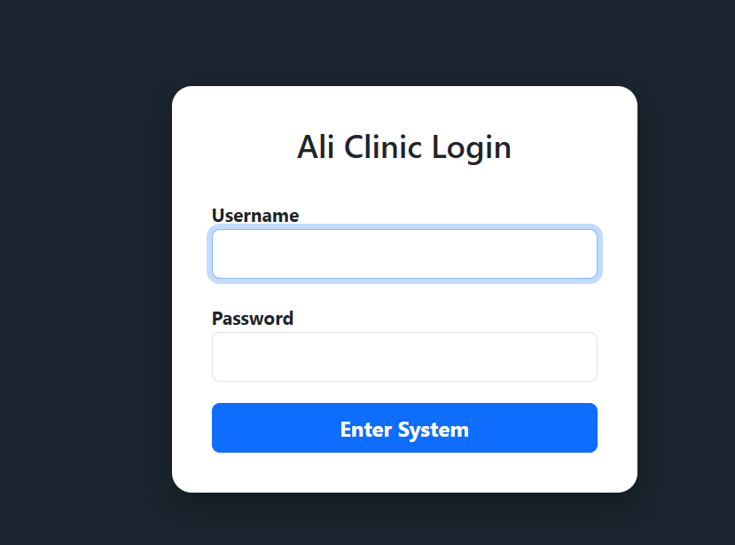
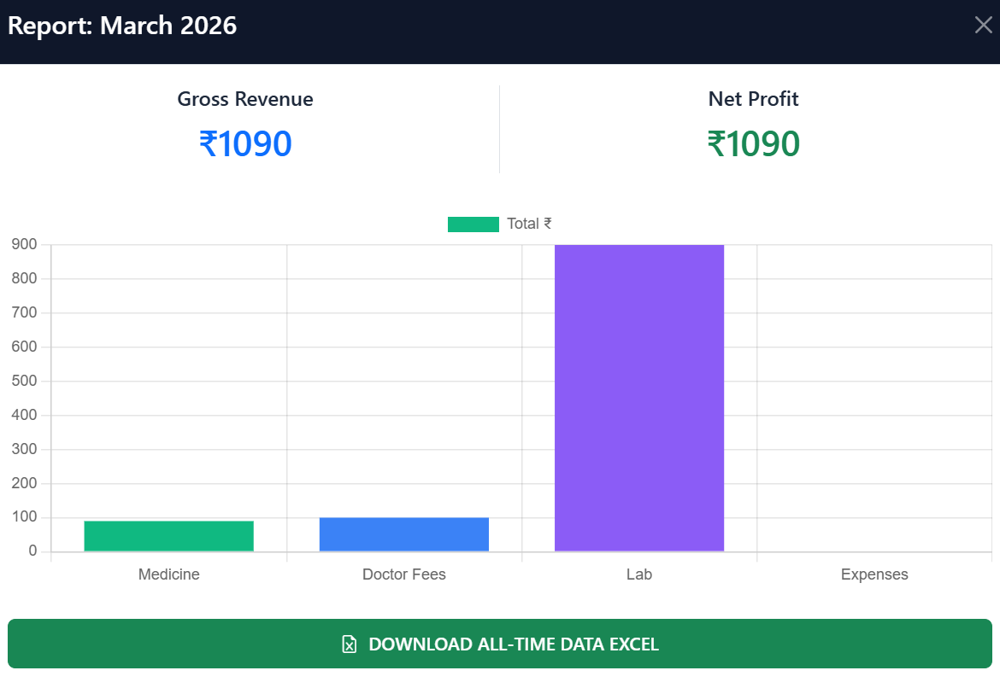
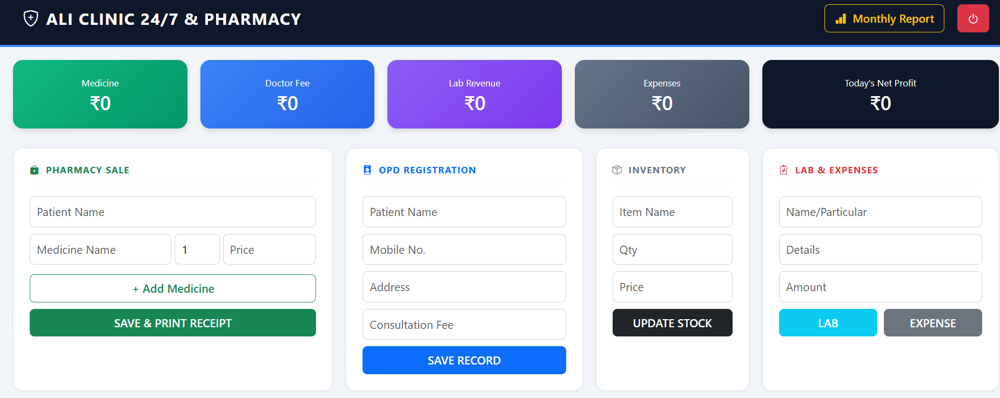

# 🏥 Clinic Management System (Live Project)

🔗 **Live Demo:** https://arbaz18.pythonanywhere.com/
**Demo Username:** ali
**Demo Password:** clinic

---

## 📌 Project Overview

This is a **data-driven clinic management system** designed to manage patient records, appointments, and healthcare operations efficiently. The system also provides basic analytics and visualization for better decision-making.

---

## 🚀 Features

* Patient registration and management
* Secure login system (authentication)
* Appointment and record tracking
* Real-time search and dynamic updates (AJAX)
* Data visualization using charts
* CSV report generation using Pandas

---

## 🛠️ Tech Stack

### Frontend:

* HTML, CSS, Bootstrap
* JavaScript (AJAX)

### Backend:

* Python
* Flask

### Database:

* SQLite
* SQL

### Data & Analytics:

* Pandas
* Chart.js

### Deployment:

* PythonAnywhere

---

## 💡 Key Highlights

* Built a full-stack web application
* Implemented CRUD operations using SQL
* Designed a **data-driven system with real-time analytics and visualization**
* Structured system for future ETL and data engineering workflows

---

## ▶️ How to Run Locally

```bash
git clone https://github.com/Arbaz7761/clinic-management-system.git
cd clinic-management-system
pip install -r requirements.txt
python app.py
```

---
## 📷 Screenshots

### 🔐 Login Page


### 📊 Dashboard


### 📈 Analytics

This project demonstrates real-world data handling, analytics, and system design aligned with data engineering concepts.

## 📌 Future Improvements
- Add role-based access (Admin/Doctor)
- Integrate REST API for scalability
- Enhance analytics with advanced dashboards
  
  **AUTHOR**
**Arbaz Ali**
